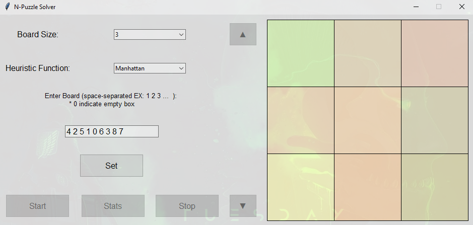
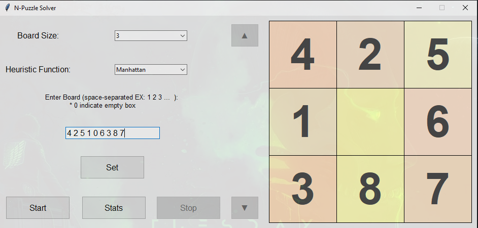
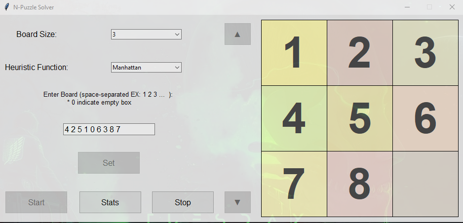
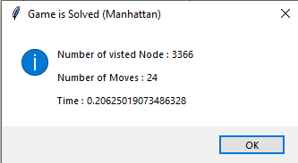
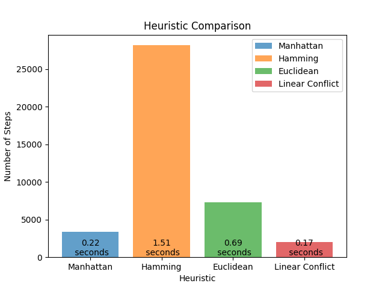
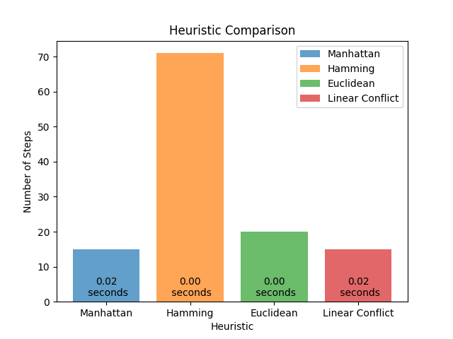
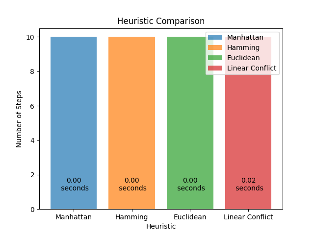

# N-Puzzle Solver

## Overview

This project is a **GUI-based N-Puzzle Solver** implemented in Python using **Tkinter** for the interface and **BFS with heuristics** for solving the puzzle efficiently. It supports **8-Puzzle, 15-Puzzle, and 24-Puzzle**.









## Features

- **Graphical User Interface (GUI)** for easy interaction.
- Supports **three board sizes**: `3x3`, `4x4`, and `5x5`.
- Utilizes **four heuristic functions** for solving:
  - **Manhattan Distance**
  - **Hamming Distance**
  - **Euclidean Distance**
  - **Linear Conflict**
- Displays step-by-step solution visually.
- Allows users to manually enter puzzle configurations.
- Compares different heuristics using a **graph visualization**.

## How to Run

1. Install required dependencies (if not installed):

   ```bash
   pip install matplotlib numpy
   ```

2. Run the main script:

   ```bash
   python N_Puzzle.py
   ```

## How It Works

- The program initializes the puzzle board and allows users to choose the size and heuristic function.
- The **Best-First Search (BFS)** algorithm with heuristics efficiently solves the puzzle by prioritizing nodes based on heuristic values.
- The steps are visually displayed on the GUI, with options to navigate through them.
- The solution is compared using different heuristics.

## Files Description

- **N_Puzzle.py** → Main entry point, initializes the GUI.
- **BFS.py** → Implements the BFS algorithm with heuristic functions.
- **GUI.py** → Handles the graphical interface.
